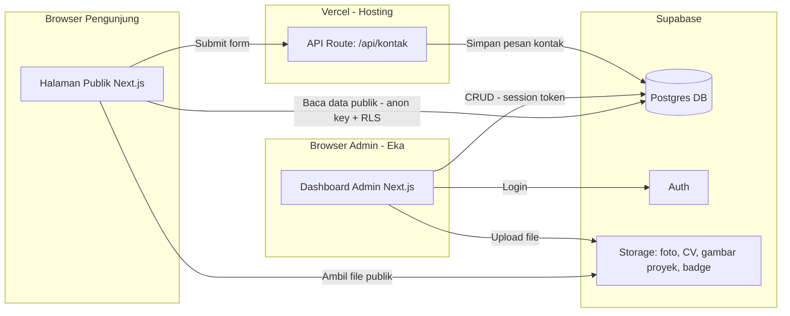

# Arsitektur Teknis

**Dokumen:** Arsitektur Sistem
**Versi:** 1.0

---

## 1. Diagram Arsitektur



## 2. Struktur Folder (Next.js App Router)

```
portfolio-eka/
├─ app/
│  ├─ (public)/
│  │  ├─ page.tsx              # Landing / Hero
│  │  ├─ tentang/page.tsx
│  │  ├─ proyek/page.tsx
│  │  ├─ proyek/[slug]/page.tsx
│  │  ├─ sertifikat/page.tsx
│  │  ├─ kontak/page.tsx
│  │  └─ layout.tsx
│  ├─ admin/
│  │  ├─ login/page.tsx
│  │  ├─ dashboard/page.tsx
│  │  ├─ profil/page.tsx
│  │  ├─ proyek/page.tsx
│  │  ├─ sertifikat/page.tsx
│  │  ├─ pesan/page.tsx
│  │  └─ layout.tsx            # guard sesi di sini
│  └─ api/
│     └─ kontak/route.ts       # handle submit form kontak
├─ components/
│  ├─ ui/                      # button, glass-panel, badge, dsb
│  ├─ hero/                    # visual 3D/particle
│  └─ admin/                   # form CRUD, tabel, uploader
├─ lib/
│  ├─ supabase/
│  │  ├─ client.ts             # browser client (anon key)
│  │  ├─ server.ts             # server client (cookie-based session)
│  │  └─ admin.ts              # service role client (server-only)
│  └─ types.ts
├─ middleware.ts                # proteksi /admin/*
├─ public/
├─ tailwind.config.ts
└─ .env.local
```

## 3. Strategi Fetching Data

- Halaman publik: **Static Generation + ISR** (`revalidate: 60–300 detik`) — cepat, namun tetap sinkron dengan perubahan admin tanpa perlu redeploy.
- Halaman detail proyek: `generateStaticParams` dari slug proyek di DB, ISR juga diterapkan.
- Dashboard admin: **client-side fetching** dengan Supabase client (tidak perlu SSG karena selalu butuh data terbaru dan bersifat privat).

## 4. Autentikasi Admin

- Supabase Auth (email + password); hanya 1 akun admin dibuat manual lewat Supabase dashboard (tanpa halaman signup publik).
- Sesi disimpan via cookie menggunakan helper `@supabase/ssr`.
- `middleware.ts` memeriksa sesi di setiap request ke `/admin/*`, redirect ke `/admin/login` bila sesi tidak valid.

## 5. Upload & Storage

- Bucket terpisah: `profile-photos`, `project-images`, `certificate-badges`, `cv-files`.
- Kebijakan: `SELECT` publik di semua bucket (agar frontend bisa tampilkan gambar), `INSERT/UPDATE/DELETE` hanya role `authenticated`.
- Optimasi gambar via `next/image`, dengan domain Supabase Storage di-whitelist di `next.config.js`.

## 6. Library Animasi

| Kebutuhan | Library | Catatan |
|---|---|---|
| Transisi UI, reveal, hover | **Framer Motion** | Ringan, deklaratif, kompatibel dengan Server/Client Component |
| Visual 3D/particle di hero | **React Three Fiber + drei** | Jaringan partikel/node 3D; sediakan fallback canvas 2D ringan untuk mobile low-end |
| Orkestrasi scroll kompleks (opsional) | **GSAP + ScrollTrigger** | Hanya bila efek scroll di luar kemampuan Framer Motion |

## 7. Environment Variables

```
NEXT_PUBLIC_SUPABASE_URL=
NEXT_PUBLIC_SUPABASE_ANON_KEY=
SUPABASE_SERVICE_ROLE_KEY=   # server-only, jangan pernah expose ke client
```

## 8. Pertimbangan Keamanan

- Row Level Security aktif di semua tabel (detail di `04-SKEMA-DATABASE.md`).
- Service role key hanya dipakai di server action/API route, tidak pernah masuk ke client bundle.
- Form kontak: validasi server-side + honeypot field sederhana untuk anti-spam (tanpa captcha berbayar di MVP).
- Rate limit sederhana pada `api/kontak` untuk mencegah spam submit.
